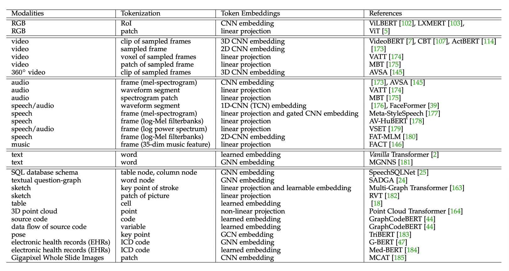
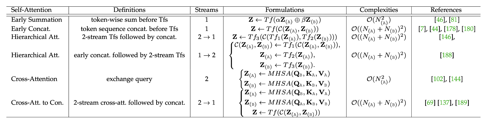
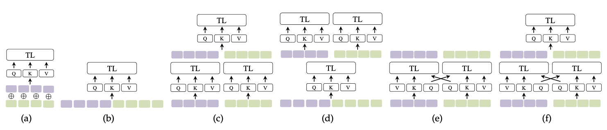
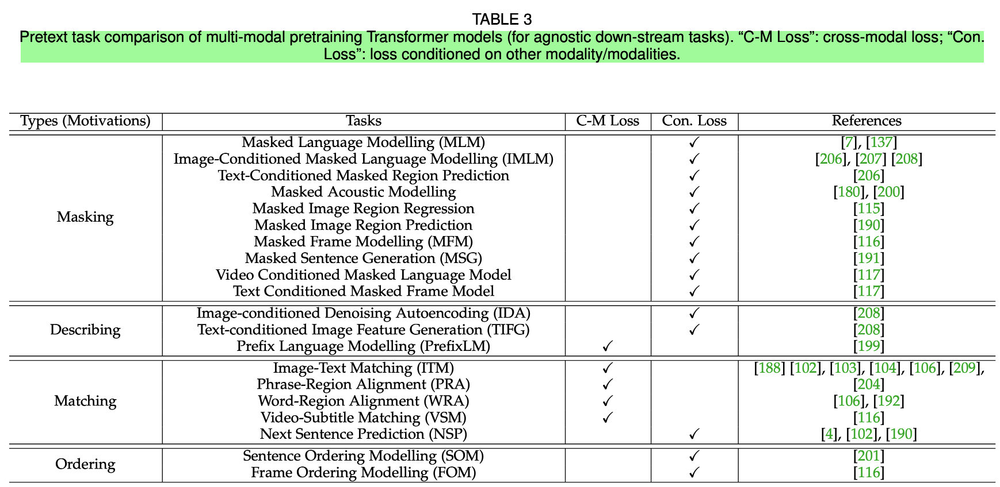

# Neko Knowledge Base

This document currently serves as a knowledge base talking about different inputs from various references that can be useful for building Neko. As of now, this only contains information from one paper (Multimodal Learning with Transformers survey), however, this should change soon.

## Papers and their main takeaways

### Multimodal Learning with Transformers Survey ([ArXiv](https://arxiv.org/abs/2206.06488))

- Treat self-attention as graph style modeling, models input sequence as a fully-connected graph. Every modality can be thought of as a graph
	- Text –> every token is a node, and the sequence is the edges connecting them
	- RGB image –> grid graph in pixel space
	- Video & Audio –> clip based graphs over space of temporal and/or semantic patterns
	- Human poses –> key points are nodes, and connections are edges
- Cross-modal interactions are essentially processed by self-attention and its variants
- While implementing transformers, implement pre-normalisation not post (as was done in Vanilla transformer).
- Treat the Transformer-based multimodal pretraining pipelines having three key components, from  bottom to top, i.e., Tokenization, Transformer representation (self-attention variants),  objective supervision (pretraining strategy).
- **Token embedding fusion** – each token could be represented by multiple embeddings. In simplest cases of text, this already happens as for each token we do summation of *token embedding* *⊕* *position embedding*. But there can be more,
	- In VisualBERT, segment embeddings are token-wise added to indicate which modality (vision or language) each token is from
	- In VL-BERT, each token has *linguistic token embedding* *⊕* *full image visual feature embedding*
	- In ImageBERT, five embeddings get fused together – *image  embedding ⊕ position embedding ⊕ linguistic embedding  ⊕ segment embedding ⊕ sequence position embedding*
- **Trends emerging**
	1. Vision language pretraining : image+language, or video+language. Examples: Two-stage (need object detector such as Faster-RCNN) (e.g., [LXMERT](https://arxiv.org/abs/1908.07490), [ViLBert](https://arxiv.org/abs/1908.02265), [VL-Bert](https://arxiv.org/abs/1908.08530)) and end-to-end (e.g., [Pixel-Bert](https://arxiv.org/abs/2004.00849), [SOHO](https://arxiv.org/abs/2104.03135), [KD-VLP](https://arxiv.org/abs/2109.10504), [Simvlm](https://arxiv.org/abs/2108.10904)). Two-stage  pipelines have a main advantage – object-aware perceiving.
	2. Speech can be used as text. Many papers end up converting speech to text using ASR and applying the language techniques itself
	3. Currently, most multimodal pretraining works are overly dependent on existence of *well-aligned* multimodal samples, or pairs/tuples. Using weakly-aligned or even unpaired/unaligned multimodal data is still understudied.
	4. Most of the pretraining tasks transfer well across modalities. For e.g. MLM in text domain has been applied to both audio and image, e.g., Masked Acoustic Modeling, Masked Image Region Prediction.
- **Cross-modal Alignment is still a challenge**
	- A representative practice is to map two modalities into  a common representation space with contrastive learning  over paired samples. The models based on this idea are often enormous in size and expensive to optimize from millions  or billions of training data
- **Improving Transferability is a challenge**
	- Transferability : How to  transfer models across different datasets and applications.
	- Data augmentation and adversarial perturbation strategies help multimodal Transformers to improve the generalization ability. VILLA [210] is a two-stage strategy (task-agnostic adversarial pretraining, followed by task-specific adversarial finetuning) that improves VLP Transformers.
	- In real applications, multimodal pretrained Transformers sometimes  need to handle the uni-modal data at inference stage due  to the issue of missing modalities. One solution is using  knowledge distillation, e.g., [distilling from multimodal to  uni-modal attention in Transformers](https://arxiv.org/abs/2110.08270), [distilling from  multiple uni-modal Transformer teachers to a shared Transformer encoder](https://arxiv.org/abs/2112.07074)

## Dealing with different modalities

### Tokenisation and embedding function

### Self-attention variants

- XA and XB from two arbitrary modalities,
- Z(A) and Z(B) denote their respective token embeddings
- `Z` denoting the token embedding (sequence) produced by  the multimodal interactions
- `Tf(·)` stands for the processing  of Transformer layers/blocks.
	- e.g. in “Early Summation”, `Z ← Tf(αZ(A) ⊕ βZ(B)) = MHSA(Q(AB), K(AB), V(AB))`
- Note : these self-attention variants are modality-generic, and can be flexibly combined and nested.
	- [TriBERT](https://arxiv.org/abs/2110.13412) is a tri-modal cross-attention (co-  attention) for vision, pose, and audio, where given a Query  embedding, its Key and Value embeddings are the con-  catenation from the other modalities

| Self-Attention Variant       | Pros                                                                                                    | Cons                                                                       | Remarks                                                                                                                                                                 | Reference Papers |
| ---------------------------- | ------------------------------------------------------------------------------------------------------- | -------------------------------------------------------------------------- | ----------------------------------------------------------------------------------------------------------------------------------------------------------------------- | ---------------- |
| a. Early Summation              | No increase in computational complexity                                                                 | Manually set weights                                                       | Summation of position embedding is a case of early summation                                                                                                            |                  |
| b. Early Concatenation          | Each modality can be encoded well by conditioning the context of other modalities                       | Time complexity                                                            | Also known as All-attenion, or Co-Transformer                                                                                                                           |                  |
| c. Hierarchical Attention (1→2) | TBA                                                                                                     | TBA                                                                        | Multimodal inputs are encoded by independent  Transformer streams and their outputs are concatenated and  fused by another Transformer. Also known as late interaction. |                  |
| d. Hierarchical Attention (2→1) | TBA                                                                                                     | TBA                                                                        | TBA                                                                                                                                                                     |                  |
| e. Cross-Attention              | - attends to each modality conditioned only on the other   - no increase in computational complexity | Fails to perform cross-modal attention globally and can lose whole context   no self-attention to attend to self-context inside each modality | Query stream is exchanged in a cross-stream manner                                                                                                                      |                  |
|  f. Cross-Attention to Concatenation                           | Alleviates some drawbacks of cross-attention                                                                                                         | Time complexity increases                                                                           | Two streams of cross-attention get concatenated and processed by another transformer to model global context better                                                                                                                                                                         |                  |
- For  enhancing and interpreting the fusion of MML, [probing the  interaction and measuring the fusion between modalities](https://proceedings.neurips.cc/paper/2021/hash/23fa71cc32babb7b91130824466d25a5-Abstract.html) would be an interesting direction to explore

### Pre-training tasks

*Task-Agnostic Multimodal Pretraining*
* Discriminative task oriented pretraining  models do not involve the decoders of Transformer. How to design more unified pipelines that can work  for both discriminative and generative down-stream tasks  is also an open problem to be solved.
* Some practices demonstrate that multi-task training (by adding auxiliary loss) [111](https://arxiv.org/abs/1912.02315), [137](https://arxiv.org/abs/2107.14572) and adversarial training improve multimodal pretraining Transformers to further boost  the performance. However, whether more complexity  is better remains a question.

*Need for Task-Specific Multimodal Pretraining*
- Guhur et al. propose [in-domain pretraining for vision-and-language navigation](https://arxiv.org/abs/2108.09105), as the general VLP focuses on learning vision-language correlations, not designed for se-  quential decision making as required in embodied VLN.
- Special modalities have their own unique domain  knowledge that can be used to design the specific pretrain  pretexts. [GraphCodeBERT](https://arxiv.org/abs/2009.08366) uses two structure-aware  pretext tasks (i.e., predict where a variable is identified from,  data flow edge prediction between variables) for program-  ming source code.

## Multimodal Datasets

This section can be structured better to describe in a line or two what each dataset contains, which language it is of, what modalities it contains, and how big it is. Feel free to take a stab at [#4 issue](https://github.com/ManifoldRG/Manifold-KB/issues/4).

### Widely used
* [Conceptual  Captions](https://ai.google.com/research/ConceptualCaptions/)
* [COCO](https://cocodataset.org/#home)
* [LAION-400M](https://laion.ai/blog/laion-400-open-dataset/)
* [VQA](https://visualqa.org/)
* [Visual Genome](https://homes.cs.washington.edu/~ranjay/visualgenome/index.html)
* [SBU Captions](https://www.cs.rice.edu/~vo9/sbucaptions/)
* [Cooking312K](https://arxiv.org/abs/1904.01766)
* [LAIT](https://arxiv.org/abs/2001.07966)
* [e-SNLI-VE](https://github.com/maximek3/e-ViL)
* [ARCH](https://arxiv.org/abs/2103.05121)
* [Adversarial VQA](https://adversarialvqa.org/#:~:text=Adversarial%20VQA%20is%20a%20new,%2Dthe%2Dart%20VQA%20systems.)
* [OTT-QA](https://ott-qa.github.io/)
* [MULTIMODALQA (MMQA)](https://github.com/allenai/multimodalqa) 
* [VALUE](https://value-benchmark.github.io/)
* [Fashion IQ](https://github.com/XiaoxiaoGuo/fashion-iq)
* [LRS2-BBC](https://www.robots.ox.ac.uk/~vgg/data/lip_reading/lrs2.html)
* [ActivityNet](http://activity-net.org/)
* [VisDial](https://visualdialog.org/)

### Million Scale
- [Product1M](https://github.com/zhanxlin/Product1M)
- [Conceptual 12M](https://github.com/google-research-datasets/conceptual-12m)
- [RUC-CAS-WenLan](https://arxiv.org/abs/2103.06561v6) (30M)
- [HowToVQA69M](https://antoyang.github.io/just-ask.html) 
- [HowTo100M](https://www.di.ens.fr/willow/research/howto100m/) 
- [ALT200M](https://arxiv.org/abs/2111.12233)

### More than 2 modalities

- [MultiBench](https://github.com/pliang279/MultiBench) provides a dataset including 10  modalities
- [Pano-AVQA](https://github.com/HS-YN/PanoAVQA)
- [YouTube-360 (YT-360)](http://www.svcl.ucsd.edu/projects/AVSpatialAlignment/) (360◦ videos)
- [AIST++](https://google.github.io/aistplusplus_dataset/factsfigures.html)  (a new multimodal dataset of 3D dance motion and  music)
- [Artemis](https://www.artemisdataset.org/) (affective language for visual arts) [v2](https://www.artemisdataset-v2.org/)

### Non-QA or captioning
- [M3A](https://github.com/midas-research/m3a-acl) (financial dataset)
- [X-World](https://openaccess.thecvf.com/content/ICCV2021/papers/Zhang_X-World_Accessibility_Vision_and_Autonomy_Meet_ICCV_2021_paper.pdf) (autonomous drive)
- [MultiMET](https://aclanthology.org/2021.acl-long.249/) (a multimodal dataset for metaphor understanding)
- [Hateful Memes](https://ai.meta.com/blog/hateful-memes-challenge-and-data-set/) (hate speech in multimodal  memes)
- [cooking video YouCookII](http://youcook2.eecs.umich.edu/) 

## Transformer Applications

The list may not be exhaustive and feel free to send a PR to include something not covered here yet. The usefulness of these can be when we wish to test our generalist agent on different kind of tasks, we can try to use these for comparison purposes, as well as to find the datasets and code required.

### Discriminative

- RGB & optical flow  [46](https://openaccess.thecvf.com/content_CVPR_2020/papers/Gavrilyuk_Actor-Transformers_for_Group_Activity_Recognition_CVPR_2020_paper.pdf)
- RGB & depth [213](https://arxiv.org/abs/2204.08721),
- RGB & point cloud [214](https://arxiv.org/abs/2210.01391),
- RGB  & LiDAR [215](https://arxiv.org/abs/2104.09224), [216](https://arxiv.org/abs/2203.11496),
- textual description & point cloud [31](https://openaccess.thecvf.com/content/ICCV2021/papers/Zhao_3DVG-Transformer_Relation_Modeling_for_Visual_Grounding_on_Point_Clouds_ICCV_2021_paper.pdf),
- acoustic & text [180](https://arxiv.org/abs/2102.05766),
- audio & visual observation for  Audio-Visual Navigation [76](https://openaccess.thecvf.com/content/CVPR2021/html/Chen_Semantic_Audio-Visual_Navigation_CVPR_2021_paper.html),
- speech query & schema of  SQL database [25](https://arxiv.org/abs/2201.01209),
- text question/query & the schema SQL  database [24](https://arxiv.org/abs/2111.00653),
- audio & tags [217](https://arxiv.org/abs/2010.14171),
- multimodal representation  for video [218](https://arxiv.org/abs/2007.10639), [219](https://openaccess.thecvf.com/content/CVPR2022/papers/Shvetsova_Everything_at_Once_-_Multi-Modal_Fusion_Transformer_for_Video_Retrieval_CVPR_2022_paper.pdf),
- text query & video [220](https://www.ecva.net/papers/eccv_2022/papers_ECCV/papers/136740227.pdf),
- audio & video for Audio-Visual Video Parsing [173](https://proceedings.neurips.cc/paper/2021/hash/5f93f983524def3dca464469d2cf9f3e-Abstract.html),
- audio  & video for audio-visual speech recognition [134](https://arxiv.org/abs/1809.02108),
- video &  text for Referring Video Object Segmentation (RVOS) [221](https://arxiv.org/abs/2111.14821),
- source code & comment & data flow [44](https://arxiv.org/abs/2009.08366),
- image & text for  retrieval [222](https://ir.webis.de/anthology/2021.sigirconf_conference-2021.135/)

### Generative

- single-modality to  single
	- raw audio to 3D mesh sequence [39](https://arxiv.org/abs/2112.05329),
 	- RGB to 3D scene [40](https://arxiv.org/abs/1902.06729),
  	- single image to 3D human texture  estimation [223](https://arxiv.org/abs/2109.02563),
  	- RGB to scene graph [19](https://arxiv.org/pdf/2301.00351.pdf), [224](https://arxiv.org/abs/2003.12962), [225](https://arxiv.org/abs/2110.05731), [226](https://openaccess.thecvf.com/content/ICCV2021/html/Lu_Context-Aware_Scene_Graph_Generation_With_Seq2Seq_Transformers_ICCV_2021_paper.html),
  	- graph to graph [33](https://www.researchgate.net/publication/352505934_Learning_Knowledge_Graph-based_World_Models_of_Textual_Environments),
  	- knowledge graph to text [227](https://www.arxiv-vanity.com/papers/2106.10502/),
  	- video  to scene graph [228](https://www.researchgate.net/publication/321325923_Appearance-and-Relation_Networks_for_Video_Classification),
  	- video to caption [229](http://proceedings.mlr.press/v95/chen18b/chen18b.pdf), [230](https://openaccess.thecvf.com/content/CVPR2022/papers/Lin_SwinBERT_End-to-End_Transformers_With_Sparse_Attention_for_Video_Captioning_CVPR_2022_paper.pdf), [231](https://digital.library.adelaide.edu.au/dspace/handle/2440/134309),  [232](https://arxiv.org/abs/2108.07781),
  	- image to caption [233](https://arxiv.org/abs/1908.06954), [234](https://openaccess.thecvf.com/content_CVPR_2020/papers/Pan_X-Linear_Attention_Networks_for_Image_Captioning_CVPR_2020_paper.pdf), [235](https://arxiv.org/abs/2103.03493), [236](https://arxiv.org/pdf/2107.06912v1.pdf), [237](https://openaccess.thecvf.com/content/CVPR2021/papers/Xu_Towards_Accurate_Text-Based_Image_Captioning_With_Content_Diversity_Exploration_CVPR_2021_paper.pdf),
  	- text  to speech [238](https://ojs.aaai.org/index.php/AAAI/article/view/4642),
  	- text to image [205](https://arxiv.org/abs/2102.12092), [239](https://proceedings.neurips.cc/paper/2021/file/a4d92e2cd541fca87e4620aba658316d-Paper.pdf),
  	- text to shape  [240](https://openaccess.thecvf.com/content/CVPR2022/papers/Sanghi_CLIP-Forge_Towards_Zero-Shot_Text-To-Shape_Generation_CVPR_2022_paper.pdf),
  	- RGB to 3D human pose and mesh [41](https://arxiv.org/abs/2012.09760),
 
- multimodality to single modality
	- image  & text to scene graph [242](https://arxiv.org/abs/2109.02227),
 	- Video Dialogue (text & audio &  visual to text) [243](https://arxiv.org/abs/2007.03848),
  	- Mono Audio & Depth to Binaural Audio  [14](https://arxiv.org/abs/2111.08046),
  	- music piece & seed 3D motion to long-range future 3D  motions [146](https://arxiv.org/abs/2101.08779),
  	- X-raying image & question to answer [244](https://arxiv.org/pdf/2104.00926.pdf),
  	- video & text & audio to text [245](https://arxiv.org/abs/2101.12059)
  	- multimodality to  multimodality (e.g., [246](https://arxiv.org/abs/2103.00823)).
